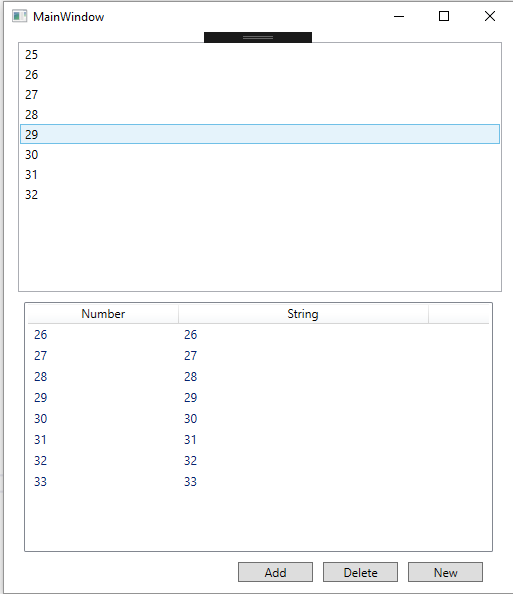

# Data Binding for ListView and ListBox

## Introduction

In this article, I want to explore the tricky aspects of data binding for ListView and ListBox. 

1. When we add or remove items from the data-bound list, the ListView or ListBox should also update. 
1. When items in the list are modified, the UI should also update.
1. When the reference for the list itself is changed by creating a new list.

There are a bunch of small caveats to achieving this and I will go into minimal example illustrating how to do this.

## Test Example

The following test example will be used where we have a `ListBox` and `ListView`. `ListBox` just is a list of elements whereas `LixtView` is able to show multiple columns of information. Our main window has a `ListBox` followed by a `ListView`.



In our example, we have three buttons. Add will add numbers to the end of the list, remove will remove numbers from the top of the list and new will change all the elements in the list.

### XAML Code

```xml
<ListBox ItemsSource="{Binding numbers_list}" Margin="4,0,1,10" Height="250">
</ListBox>
<ListView Grid.Row="4" Grid.Column="0" Margin="10,0,10,10" ItemsSource="{Binding numstr_list}" Name="Tasks" Height="250">
    <ListView.View>
        <GridView>
            <GridView.Columns>
                <GridViewColumn Header="Number" Width="150" DisplayMemberBinding="{Binding Path=num}"></GridViewColumn>
                <GridViewColumn Header="String" Width="250" DisplayMemberBinding="{Binding Path=str}"></GridViewColumn>
            </GridView.Columns>
        </GridView>
    </ListView.View>
</ListView>
```

The `ListBox` binds to `numbers_list` and `ListView` to `numstr_list`.

## Bad Design Pattern Method (Or for static Lists)

This is a bad design pattern to achieve data binding though it works. 

For data binding for `ListBox`,

```csharp
public List<int> numbers_list { get; set; }
```

and data binding for `ListView`, 

```csharp
public class NumberString
{
    public int num { get; set; }
    public string str { get; set; }
}

public List<NumberString> numstr_list { get; set; }
```

Of course after the first UI update, it never changes when you modify the lists. This is okay if your list does not change.

## Nuclear Option to Refresh Data Binding

If you do use `List`, there is always the heavy option of resetting the data binding to refresh all the values. However, this is not efficient and it possibly result in a lot of updates. 

```csharp
this.DataContext = null;
this.DataContext = this;
```

This will work and you'll have to remember to call this every time you update the list and this will refresh everything.

This is a good fallback if things aren't working and you have to test if it's the data binding that's not working or something else. Data binding errors don't throw exceptions but just have at most a message in the output.

## Don't Use Lists! (Despite the Name)

Both `ListBox` and `ListView` makes you want to use `List` but if you do so, any update to the list will not be updated. To get updates, you should use `ObservableCollection`.

### ObservableCollection

When using `ObservableCollection`, it will update the UI when the following happens:

1. Collection changes and new items are added or removed
1. Reference or primitive type values change in the list

Thus, the way to bind `ListBox` is to use the following

```csharp
public ObservableCollection<int> numbers_list { get; set; }
```

So, when numbers are added, removed or modified, the `ListBox` automatically updates the UI.

### WRONG WAY! ListView Not Updating When Members Change

To bind to `ListView`, we could do the following.

But, this leads to the list not updating when `num` or `str` value inside the class has been changed. 

```csharp
public class NumberString
{
    public int num { get; set; }
    public string str { get; set; }
}

public ObservableCollection<NumberString> numstr_list { get; set; }

```

## INotifyPropertyChanged

When a class member changes, the reference to the object remains the same and thus, `ObservableCollection` has no way to know that the item has changed. The way to achieve notifying is to use the `INotifyPropertyChanged` interface to the `NumberSting` class.

Unfortunately, it seems we lose out on the syntax shorthand we have above and we end up generating a lot of boiler-plate. Using [Fody's PropertyChange](https://github.com/Fody/PropertyChanged) attribute seems like an elegant way but I'll just show the long hand way that will work with the base compiler.

```csharp
public class NumberString : INotifyPropertyChanged
{
    int _num;
    public int num
    {
        get => _num;
        set
        {
            if (_num != value)
            {
                _num = value;
                PropertyChanged?.Invoke(this, new PropertyChangedEventArgs(nameof(num)));
            }
        }
    }

    string _str;
    public string str {
        get => _str;
        set
        {
            if (_str != value)
            {
                _str = value;
                PropertyChanged?.Invoke(this, new PropertyChangedEventArgs(nameof(str)));
            }
        }
    }

    public event PropertyChangedEventHandler PropertyChanged;
}
```

The above is a lot of boiler-plate but illustrates what is going on. We have to fire the `PropertyChanged` event after a field in the class has been set.

A slightly more concise way inspired from a [stackoverflow post](https://stackoverflow.com/questions/1315621/implementing-inotifypropertychanged-does-a-better-way-exist) is as follows:

```csharp
public class NumberString : INotifyPropertyChanged
{
    int _num;
    public int num
    {
        get => _num;
        set => SetField(ref _num, value, nameof(num));
    }

    string _str;
    public string str
    {
        get => _str;
        set => SetField(ref _str, value, nameof(str));
    }

    public event PropertyChangedEventHandler PropertyChanged;

    protected void SetField<T>(ref T field, T value, string propertyName)
    {
        if (!EqualityComparer<T>.Default.Equals(field, value))
        {
            field = value;
            PropertyChanged?.Invoke(this, new PropertyChangedEventArgs(propertyName));
        }
    }
}
```

We just move a lot of boilerplate to a function call `SetField`. This will be handy if you have a lot of fields.

## Create New or Replace List

What if we just created a new list and replaced the the list with a new one. The UI will not update as it still holds old reference. We have to go back to the `INotifyPropertyChanged` and do the same thing for `MainWindow` class.

```csharp
ObservableCollection<int> _numbers_list;
public ObservableCollection<int> numbers_list { get=>_numbers_list; set=>SetField(ref _numbers_list, value, nameof(numbers_list)); }
```

## Conclusion

We have shown how to do data-binding for `ListBox` and `ListView` and have it update when the actual list data changes or the value in one of the objects in the list changes. 